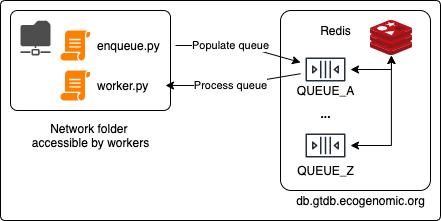

# ACE cluster orchestrator

This repository is a template for distributing and orchestrating jobs across the ACE cluster.



## 1. Setup

### 1a. Repository

Clone this repository into a new directory that is accessible by all worker nodes in the cluster (or, make note to copy it later).

```shell
git clone git@github.com:Ecogenomics/ace-cluster-orchestrator.git
```

### 1b. Environment

It is strongly recommended that you do all of this inside a new conda environment, or Python virtualenv.

The orchestrator uses [Redis Queue (rq)](https://python-rq.org/docs/) and [Redis-py (redis)](https://github.com/redis/redis-py).

```shell
python -m pip install -r requirements.txt
```

## 2. Editing files

### 2a. enqueue.py

This file will contain the logic to generate each of the jobs that will be run on the cluster.
It will require the Redis password to `db.gtdb.ecogenomic.org` (this can be found on [BitWarden](https://vault.bitwarden.com/#/)).

This is a trivial example, but to get started you will need to change the `REDIS_PASS` and `QUEUE_NAME` variables
at the beginning of the script.


### 2b. worker.py

The worker script will need to be importable by the `enqueue.py` file and will likely sit in the same directory.

It is going to be most useful to use subprocess here to spawn third party programs.


## 3. Start

Ensure that you have uploaded the `enqueue.py` and `worker.py` files to the network location if you were editing them
on your local machine.

### 3a. Enqueuing jobs

Simply run the `enqueue.py file`.

### 3b. Starting workers

If you were using a conda environment, or Python virtualenv then activate it now.
Afterwards, change to the directory where `enqueue.py` and `worker.py` are located.

```shell
conda activate <env_name>
cd <path_to_repository>
```

Activate the worker, ensuring that you have substituted the following variables:

* `REDIS_PASS` for the Redis password (note: the colon before it is required).
* `QUEUE_NAME` for the queue name defined in `enqueue.py`.
* `WORKER_NAME` for a human-readable name for the worker.

```shell
rq worker --name WORKER_NAME --burst --url "redis://:REDIS_PASS@db.gtdb.ecogenomic.org" "QUEUE_NAME"
```

Note: `--burst` will terminate the worker as soon as `QUEUE_NAME` is empty.


## 4. Monitoring

Edit the `Dockerfile` and replace `REDIS_PASS` with the Redis password (keeping the colon in front of `REDIS_PASS`)

On your local machine (or any server on the UQ VPN), run the following docker command inside this directory:

```shell
docker run -p 9181:9181 -it $(docker build -q .)
```

This will run [rq-dashboard](https://github.com/Parallels/rq-dashboard) on port 9181: http://0.0.0.0:9181/


## 5. Considerations

### 5a. Large queues
When running RQ with many hundreds of thousands of jobs, it is often best to not return values. This is because RQ will 
store all results in the Redis database (as defined by the `result_ttl`). In that case, it's best to
write the results to disk.

### 5b. Queue names
Since there is only one Redis database, the queue names must be unique. It's best to check what
queues exist before creating new ones.

### 5c. Hogging resources
Since this will often distribute jobs across the entire cluster, ensure that you are lowering 
the priority of your workers. This can be done by putting `os.nice(10)` at the start of the worker code.

Note that this only affects CPU priority, if you require a lot of RAM this will not be fair.
